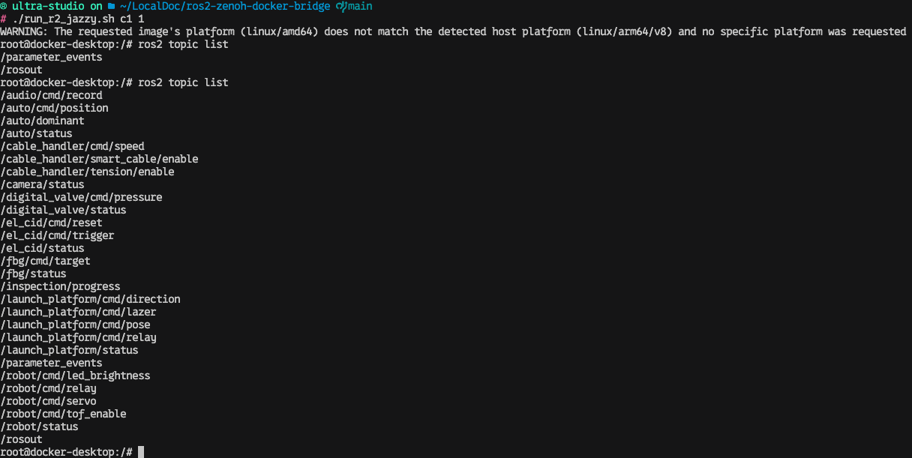
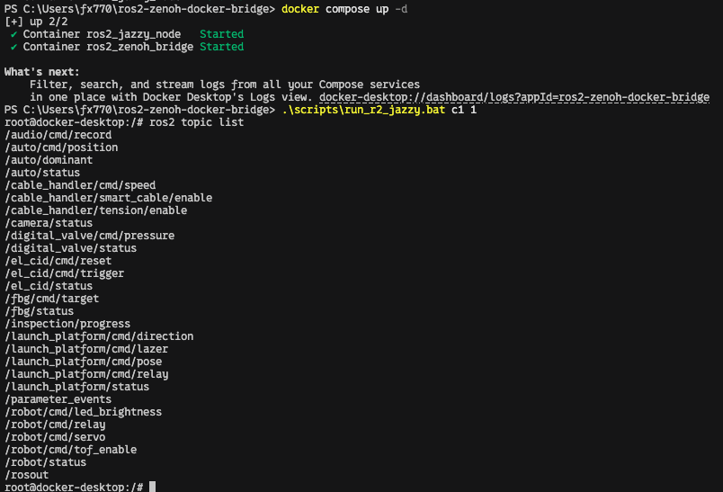

# Completely Offline Cross-Platform ROS 2 (Jazzy) via Zenoh

This repository solves the problem of connecting ROS 2 nodes running in Docker on Mac/Windows to Native Linux machines over a local network, **completely offline**, without Tailscale, VPNs, or complex DDS XML configurations.

It bypasses Docker Desktop's lack of real bridge mode by tunneling DDS multicast traffic over standard TCP using `zenoh-bridge-ros2dds`.

### System in Action

**Zenoh Bridge running and ROS 2 topics on Native Linux:**


**Mac Docker communicating with Native Linux ROS 2:**


**Windows Docker communicating with Native Linux ROS 2:**


---

## System Architecture

```text
+-------------------------------------------------------------+
| Native Linux Host (ARM64 / amd64)                           |
|                                                             |
|  [ ROS 2 Listener / Talker ]                                |
|             ^                                               |
|             | (Local DDS Multicast)                         |
|             v                                               |
|  [ zenoh-bridge-ros2dds (Listen TCP :7447) ] <===========+  |
+----------------------------------------------------------|--+
                                                           |
                      (TCP Tunnel bypasses Docker Network Isolation)
                                                           |
+----------------------------------------------------------|--+
| Mac / Windows Host                                       |  |
|                                                          |  |
|  +----------------------------------------------------+  |  |
|  | Docker Desktop Lightweight VM                      |  |  |
|  | (Shared Network Namespace via network_mode: host)  |  |  |
|  |                                                    |  |  |
|  |  [ ROS 2 Container ]                               |  |  |
|  |          ^                                         |  |  |
|  |          | (Local DDS Multicast)                   |  |  |
|  |          v                                         |  |  |
|  |  [ zenoh-bridge-ros2dds (Connect to Linux IP) ] ====>===+
|  +----------------------------------------------------+  |
+-------------------------------------------------------------+
```

## Why This Zenoh Solution is Better

## Project Structure

We've organized the workflow into simple scripts for each platform:

```text
├── .env                  # Configuration (Linux IP, Domain ID)
├── zenoh_config.json     # Performance tuning for Zenoh
├── fastdds_tuning.xml    # Performance tuning for ROS 2 (FastDDS)
├── docker-compose.yml    # Docker setup for Mac/Windows
├── Dockerfile            # ROS 2 Jazzy image definition
├── scripts/              # Helper scripts for running and stopping ROS 2
│   ├── run_r2_jazzy.sh
│   ├── run_r2_jazzy.bat
│   └── stop_all_containers.sh
├── mac/                  # Scripts for MacOS
│   ├── 1_start_docker_env.sh
│   ├── ...
├── windows/              # Scripts for Windows
│   ├── 1_start_docker_env.bat
│   ├── ...
├── linux/         # Scripts for Native Linux
│   ├── 1_install_zenoh.sh
│   ├── ...
└── tests/                # High-frequency payload tests
    ├── blob_talker.py    # Custom throughput benchmark
    ├── speed_monitor.py  # Real-time performance monitor
    └── ...
```

## How It Works

1. **Native Linux** acts as the server (Peer). It runs the standalone `zenoh-bridge-ros2dds` binary, listening on TCP port `7447`. It captures all local DDS multicast traffic and routes it to any connected clients.
2. **Mac / Windows Docker** acts as the client. Docker Compose starts a ROS 2 container (`network_mode: "host"`) alongside a Zenoh Bridge container. The bridge connects *out* of the Docker VM to the Linux machine's IP, establishing the tunnel.
3. **Optimized Transport**: Both sides are tuned to handle large fragments and high-frequency bursts (via `fastdds_tuning.xml` and `net.core` buffer increases).
4. Both sides are forced to use `RMW_IMPLEMENTATION=rmw_fastrtps_cpp` to ensure 100% vendor compatibility.

---

## Step 1: Initial Setup (All Platforms)

1. Clone this repository.
2. Copy the `.env.example` file to `.env`:
   ```bash
   cp .env.example .env
   ```
3. Open `.env` and replace `192.168.x.x` with the actual **Local IPv4 Address of your Native Linux machine**.

---

## Step 2: Native Linux Setup

Run the following scripts from the `linux` folder on your Linux machine:

1. **Install Zenoh** (Downloads the correct architecture binary: amd64 or arm64):
   ```bash
   ./linux/1_install_zenoh.sh
   ```
2. **Start the Zenoh Bridge** (Keep this running in a terminal):
   ```bash
   ./linux/2_start_zenoh_bridge.sh
   ```

---

## Step 3: Mac or Windows Setup

Open a terminal (Mac) or Command Prompt/PowerShell (Windows) and run the scripts in your respective folder.

### On Mac:
1. Start the Docker environment:
   ```bash
   ./mac/1_start_docker_env.sh
   ```

### On Windows:
1. Start the Docker environment:
   ```cmd
   windows\1_start_docker_env.bat
   ```

---

## Step 4: Testing Bidirectional Communication

You can test communication in both directions using the provided scripts.

**Test 1: Mac/Windows Talker ➡️ Linux Listener**
1. On Linux, run: `./linux/4_run_listener.sh`
2. On Mac, run: `./mac/2_run_talker.sh` (or `windows\2_run_talker.bat` on Windows)
3. You should see `Hello World` appearing on the Linux listener!

**Test 2: Linux Talker ➡️ Mac/Windows Listener**
1. On Mac, run: `./mac/3_run_listener.sh` (or `windows\3_run_listener.bat` on Windows)
2. On Linux, run: `./linux/3_run_talker.sh`
3. You should see `Hello World` appearing on the Mac/Windows listener!

---

## Step 5: Throughput Benchmarking

To measure actual bandwidth and latency:

**Option A: Mac/Windows to Linux (Standard)**
1. **On Linux**, start the monitor: `./tests/2_linux_speed_listener.sh`
2. **On Mac/Windows**, start the talker: `./tests/1_mac_speed_talker.sh`

**Option B: Linux to Mac/Windows**
1. **On Mac/Windows**, ensure Docker is running, then run: `./mac/3_run_listener.sh` (or use the speed monitor inside Docker)
2. **On Linux**, start the talker: `./tests/3_linux_speed_talker.sh`

**Custom Tests:**
Both talker scripts accept `[size_in_bytes]` and `[frequency_hz]`.
To simulate a high-resolution Lidar (1.5MB @ 10Hz):
```bash
./tests/1_mac_speed_talker.sh 1572864 10
```

---

## Troubleshooting High-Bandwidth Data (Lidar/Images)

If you experience low frequency or "freezes" when sending large messages (>1MB), follow these optimization steps:

### 1. Increase Linux Kernel Buffers
By default, Linux UDP buffers are too small for high-speed ROS 2 traffic. Run these commands on your Native Linux host:
```bash
sudo sysctl -w net.core.rmem_max=2147483647
sudo sysctl -w net.core.wmem_max=2147483647
```

### 2. FastDDS Middleware Tuning
This repository includes a `fastdds_tuning.xml` file that increases internal middleware buffers. To use it in your own nodes, export the environment variable:
```bash
export FASTRTPS_DEFAULT_PROFILES_FILE=/path/to/ros2-zenoh-docker-bridge/fastdds_tuning.xml
```

### 3. Use Compatible QoS
For high-bandwidth data like Lidar point clouds, use `BEST_EFFORT` reliability to prevent head-of-line blocking and network stalls:
- **Reliability:** `BEST_EFFORT`
- **History Depth:** `50` (Higher depth helps prevent drops during bursts)

---

## Step 6: Shutting Down

When you are finished, gracefully stop your Docker containers.

**On Mac:**
```bash
./mac/4_stop_docker_env.sh
```

**On Windows:**
```cmd
windows\4_stop_docker_env.bat
```

---

## Roadmap / Future Work

### 1. Direct Mac Docker ↔ Windows Docker Communication
Currently, the Native Linux host acts as the central router/listener that both Mac and Windows Docker VMs connect to. The next major milestone is to enable **direct communication between Mac Docker and Windows Docker** without needing the Native Linux machine.

**Planned Technical Approach:**
- Modify `docker-compose.yml` to allow one of the Docker machines (e.g., Mac) to act as the Zenoh "Server/Listener".
- Expose the Zenoh TCP port from the Docker VM to the host operating system using Docker port mapping (`ports: ["7447:7447/tcp"]`).
- Configure the Zenoh bridge on the "Server" Docker to listen (`-l tcp/0.0.0.0:7447`) instead of connecting as a client.
- Configure the "Client" Docker (e.g., Windows) to connect directly to the Mac's local network IP address.
- Create new dedicated scripts (e.g., `mac/start_as_server.sh` and `windows/start_as_client.bat`) to manage these roles seamlessly.
